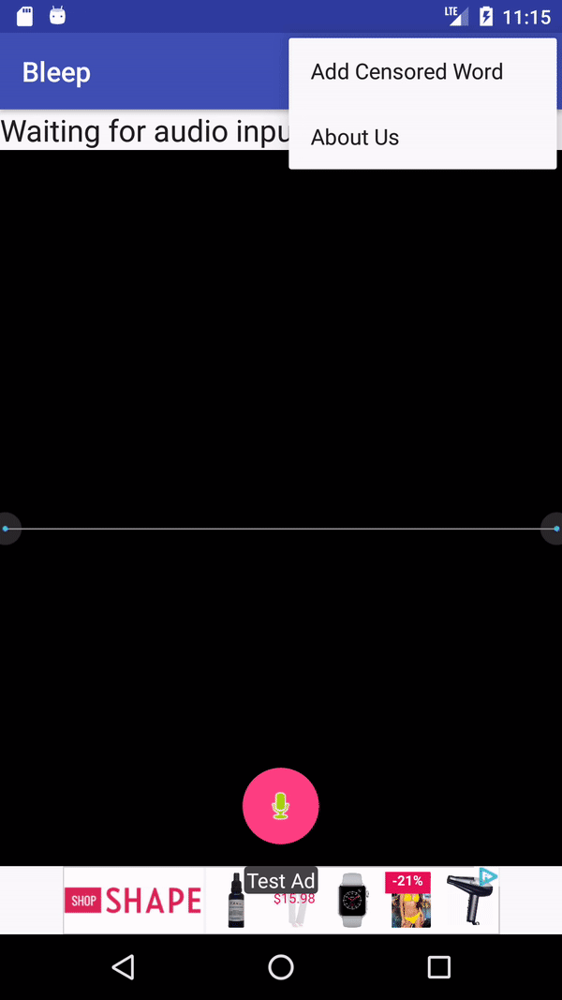
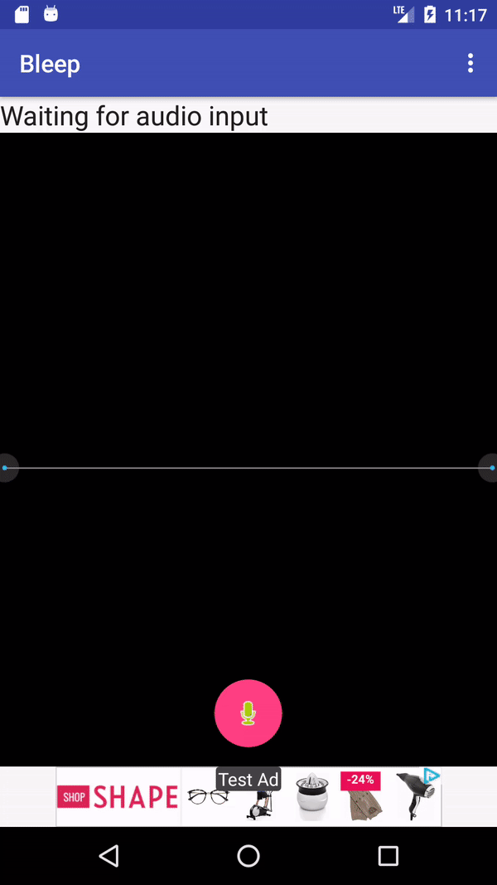

# Bleep

An Android app that automatically bleeps the censored words for you in your recordings. You can add or delete words that need to be censored to customize your list. You can also share your recordings with your friends!

## Add and Delete Cencored Words

You can customize the censored words list by input your own words, or delete the existing words.

## Auto Bleep In The App

Record your sentences and have the app automatically bleep the censored words for you.

## Authors

* **Wenting Zhou**

See also another APP I made: [Fanfou](https://github.com/zjlszsy/fanfouandroid) - an Android client for social network Fanfou.com.

## License

This project is licensed under the MIT License.

## Acknowledgments

* Hat tip to anyone who's code was used

